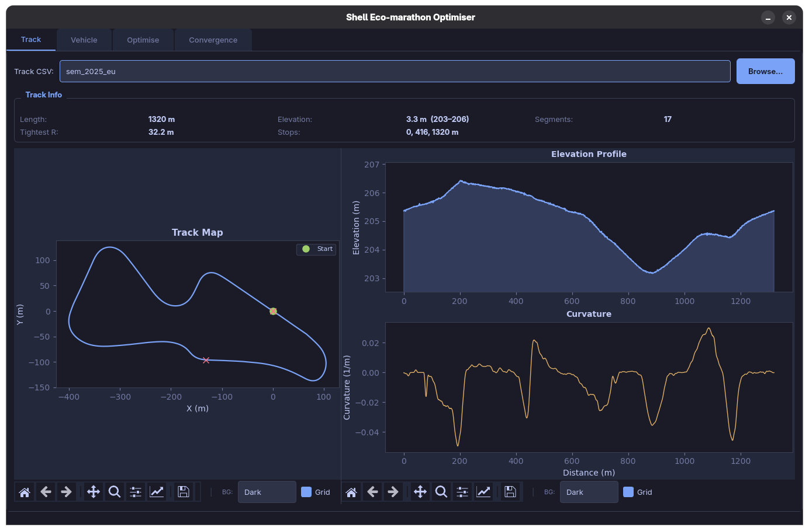

# TrackOpti — Shell Eco-marathon Energy Optimization

Trajectory optimization system for the **Shell Eco-marathon** competition.  
Minimises per-lap energy consumption while respecting track geometry, vehicle
dynamics, tyre grip limits, and mandatory-stop rules.



---

## Quick Start

```bash
# 1. Install dependencies
pip install -r requirements.txt

# 2. Run the main desktop application
python main.py
```

## Legacy CLI

You can also run the legacy CLI tool to perform the optimization without the UI:

```bash
# Run optimisation with default settings
python cli.py

# Or customise parameters
python cli.py --mass 150 --crr 0.008 --stops 80,450

# See all options
python cli.py --help
```

## Key CLI Options

| Flag | Default | Description |
|---|---|---|
| `--track` | `data/tracks/sem_2025_eu.csv` | Path to track CSV |
| `--output` | `results` | Output directory |
| `--mass` | `160` | Vehicle mass (kg) |
| `--crr` | `0.010` | Rolling resistance coefficient |
| `--motor-efficiency` | `0.85` | Motor efficiency (0–1) |
| `--max-power` | `1000` | Max motor power (W) |
| `--stops` | auto-detected | Comma-separated stop distances (m) |
| `--nodes` | `200` | Discretisation nodes |
| `--method` | `nlp` | `nlp` or `dp` (legacy aliases `direct`/`greedy` are supported) |
| `--no-plots` | off | Skip plot generation |


## Module Overview

### `vehicle_model.py`
Defines `VehicleConfig` (mass, aero, tyres, powertrain) and `VehicleDynamics`
(drag, rolling resistance, grade force, cornering limits, power/energy).

### `track_analysis.py`
Loads track CSV, computes curvature via Menger formula, identifies
straights/corners, finds worst-case mandatory-stop locations.

### `trajectory_optimizer.py`
Backward-compatible façade for trajectory optimization. Delegates to `NLPOptimizer` or `DPOptimizer` solvers.

### `optimizer_nlp.py`
CasADi / IPOPT direct-collocation solver. Builds a smooth nonlinear program (NLP) with automatic derivatives. Provides high-quality, optimal solutions but can be slower.

### `optimizer_dp.py`
Backward-induction dynamic programming (DP) solver over a distance-velocity grid. Globally optimal within grid resolution, fast, and has no external dependencies.

### `optimizer_base.py`
Shared infrastructure for the optimizers, providing discretization, feasibility passes, and energy/time computation.

### `visualize.py`
Generates velocity, force, energy, acceleration, G-G, and track-map plots
using Matplotlib.

## Roadmap

Future improvements planned for TrackOpti:

- **Energy per type visualization**: Provide detailed breakdowns of energy usage (e.g., aero drag, rolling resistance, braking).
- **Finer vehicle dynamics**: Support advanced vehicle models, including front and rear load transfer dynamics.
- **Wind vector dependent aero**
- Better rolling resistance model
- linearize by segments
- Spiderweb diagram of energy


